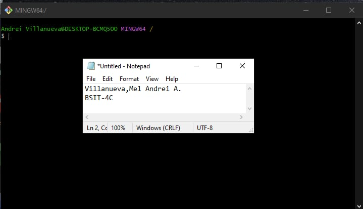
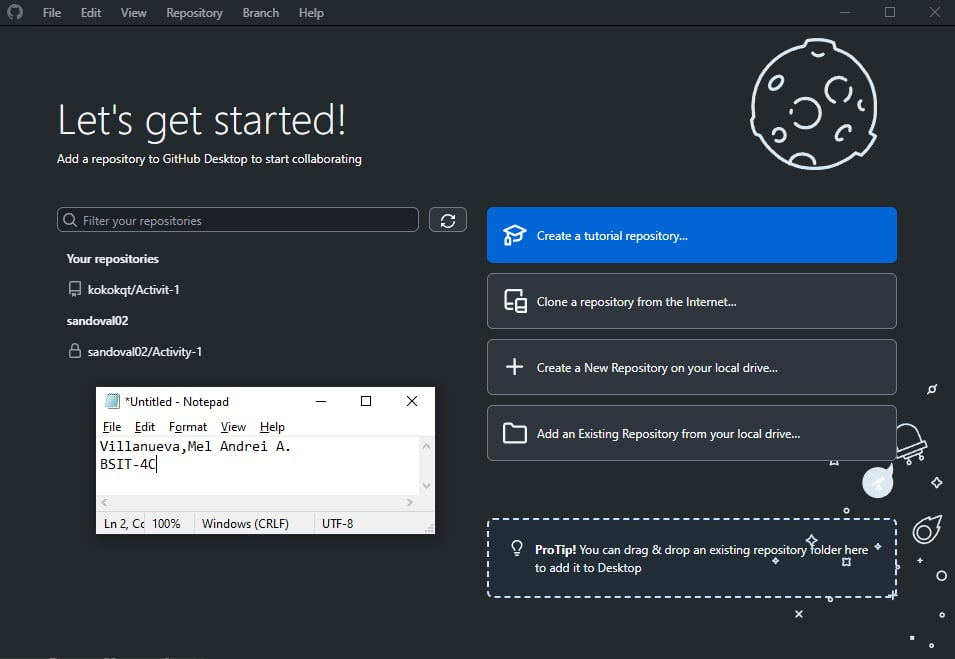
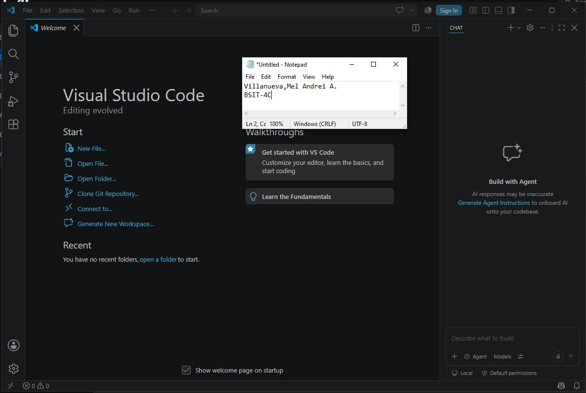
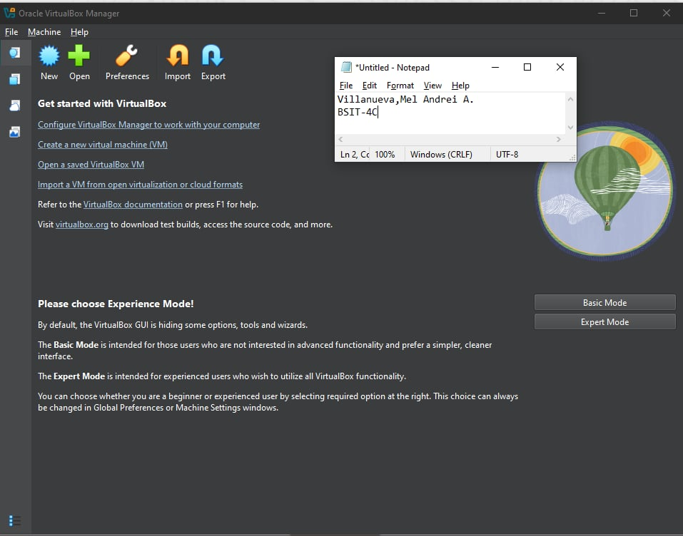
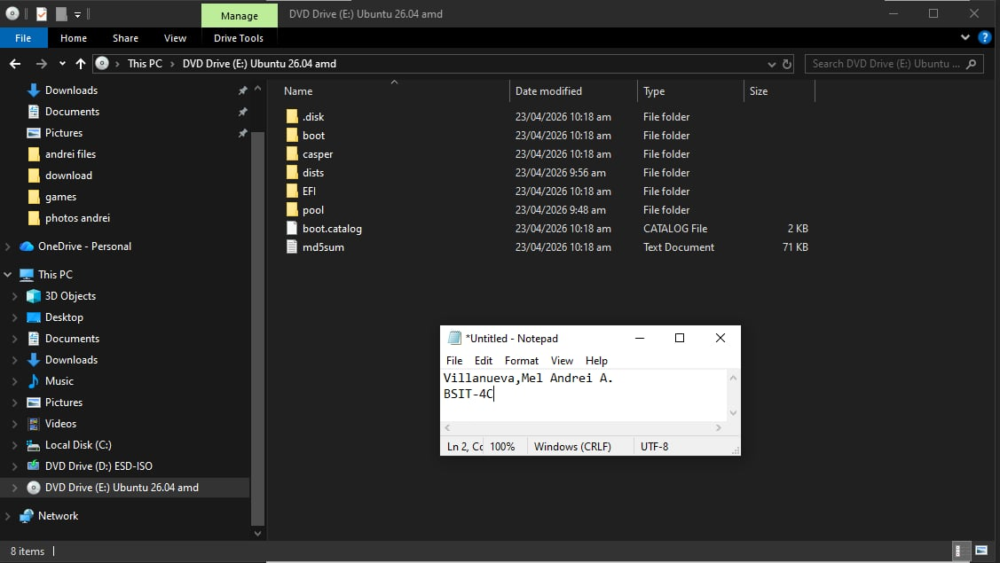
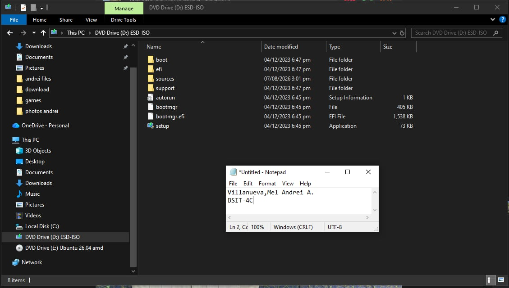

Name: Mel Andrei A. Villanueva
Course: Bachelor of Science in Information Technology (BSIT)
Section: BSIT-3C
Date: August 7, 2026

Objectives
To install the essential software needed for system administration and networking activities.
To create professional online accounts for collaboration and career development.
To become familiar with the tools commonly used by IT professionals.
To prepare a professional working environment for future laboratory activities.

Software Installed
Visual Studio Code
Git
GitHub Desktop
Oracle VirtualBox
Cisco Packet Tracer
Google Chrome
Windows Terminal

Professional Accounts
GitHub: https://github.com/kokokqt
LinkedIn: https://www.linkedin.com/in/villanueva-mel-andrei-b54551427/

## Git Installation

## GitHub Desktop Installation

## Visual Studio Code Installation

## VirtualBox Installation

## Ubuntu Server ISO Download

## Windows 10 Enterprise Evaluation ISO Download

1.Windows 10 Enterprise Evaluation ISO Download-The Microsoft download page required completing a registration form before the ISO could be downloaded.The large ISO file took a considerable amount of time to finish downloading.Resolved by completing the required information, selecting the correct version, and waiting for the download to finish successfully.

2.Ubuntu Server ISO Download-The Ubuntu Server ISO file was large, resulting in lengthy download time.The download was interrupted once due to an unstable internet connection.Resolved by restarting the download and verifying the downloaded ISO file before use.

3.Git Installation-Initially encountered confusion in selecting the appropriate installation options during the Git Setup Wizard.Some environment variables and default settings were unfamiliar, making it difficult to determine which options to choose.Resolved by following the recommended installation settings and verifying the installation using the git --version command.

This task provided me with the necessary experience and understanding of creating a professional working environment that is crucial for a future System Administrator. The installation of Git, GitHub Desktop, Visual Studio Code, VirtualBox, Ubuntu Server, and Windows 10 Enterprise Evaluation gave me experience with the tools used in system administration and software development. Although I faced difficulties like slow download speeds, installation dialogs, and configuration problems, I understood the need to follow the documentation accurately and solve the problem of proper installation of each tool.

One of the most important lessons learned is the fact that setting up a robust development environment is the first and foremost way to become a successful IT specialist. Thanks to the tools like Git and GitHub Desktop, I realized how essential it is to use version control and collaborate, making tracking changes and managing the project easy. Visual Studio Code became my tool that allowed working with the flexible code editor, supporting a number of programming languages and extensions. VirtualBox and Ubuntu Server helped to gain practical skills in working with virtualization tools and creating virtual machines without influencing the OS I am using.

In summary, this exercise improved my technical skills, patience, and problem-solving capabilities. Being a prospective System Administrator, I realize that the set up, maintenance, and troubleshooting of computer systems are some of the key roles to perform. This experience has prepared me sufficiently for more complex network and system administration tasks in the future.

https://git-scm.com/downloads
https://desktop.github.com/
https://code.visualstudio.com/
https://www.virtualbox.org/wiki/Downloads
https://ubuntu.com/download/server
https://www.microsoft.com/en-us/evalcenter/evaluate-windows-10-enterprise

